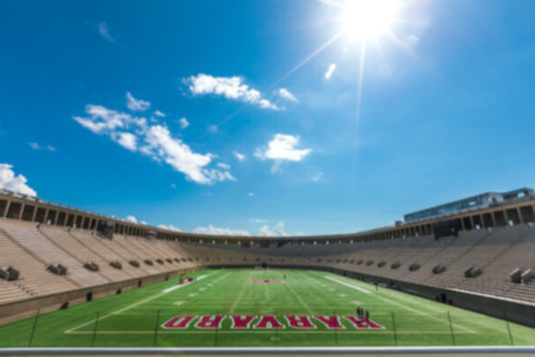
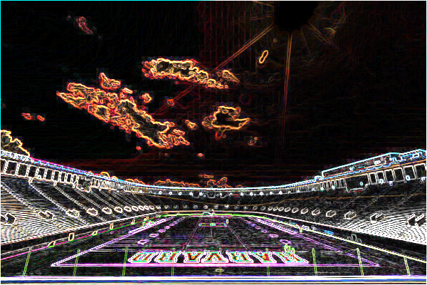

<!-- Improved compatibility of back to top link: See: https://github.com/othneildrew/Best-README-Template/pull/73 -->
<a id="readme-top"></a>
<!--
*** Thanks for checking out the Best-README-Template. If you have a suggestion
*** that would make this better, please fork the repo and create a pull request
*** or simply open an issue with the tag "enhancement".
*** Don't forget to give the project a star!
*** Thanks again! Now go create something AMAZING! :D
-->


<!-- PROJECT SHIELDS -->
<!--
*** I'm using markdown "reference style" links for readability.
*** Reference links are enclosed in brackets [ ] instead of parentheses ( ).
*** See the bottom of this document for the declaration of the reference variables
*** for contributors-url, forks-url, etc. This is an optional, concise syntax you may use.
*** https://www.markdownguide.org/basic-syntax/#reference-style-links
-->
[![Contributors][contributors-shield]][contributors-url]
[![Forks][forks-shield]][forks-url]
[![Stargazers][stars-shield]][stars-url]
[![Issues][issues-shield]][issues-url]
[![LinkedIn][linkedin-shield]][linkedin-url]

<!-- PROJECT LOGO -->
<br />
<div align="center">
  <a href="https://github.com/Pieter414/Projects/tree/main/Filter">
    
  </a>

<h3 align="center">Filter</h3>

  <p align="center">
    <a href="https://github.com/Pieter414/Projects/tree/main/Filter"><strong>Explore the docs »</strong></a>
    <br />
    <br />
    <a href="https://github.com/Pieter414/Projects/tree/main/Filter">View Demo</a>
    ·
    <a href="https://github.com/Pieter414/Projects/issues/new?labels=bug&template=bug-report---.md">Report Bug</a>
    ·
    <a href="https://github.com/Pieter414/Projects/issues/new?labels=enhancement&template=feature-request---.md">Request Feature</a>
  </p>
</div>


<!-- TABLE OF CONTENTS -->
<details>
  <summary>Table of Contents</summary>
  <ol>
    <li>
      <a href="#about-the-project">About The Project</a>
      <ul>
        <li><a href="#built-with">Built With</a></li>
      </ul>
    </li>
    <li>
      <a href="#getting-started">Getting Started</a>
      <ul>
        <li><a href="#prerequisites">Prerequisites</a></li>
      </ul>
    </li>
    <li><a href="#usage">Usage</a></li>
    <li><a href="#contact">Contact</a></li>
    <li><a href="#acknowledgments">Acknowledgments</a></li>
  </ol>
</details>


<!-- ABOUT THE PROJECT -->
## About The Project

This program is able to 'filter' images, by changing RBG (Red, Blue, Green) data in file images and using an algorithm to essentially recolor the image as a filter. There are five types of filters that the program is able to run. Grayscale, to turn images black and white. Sepia, to turn images like old photos yellowish color. Rotate, to rotate the image horizontally. Blur, to blur the image. And lastly, Edges to identify the edge in the picture. 

<p align="right">(<a href="#readme-top">back to top</a>)</p>


### Built With

* 

<p align="right">(<a href="#readme-top">back to top</a>)</p>


<!-- GETTING STARTED -->
## Getting Started

### Prerequisites

1. Images file are 24-bit uncompressed BMP 4.0 file
2. Only using the provided filter keys 

### How to Run
1. First, compile the filter.c into filter
```
make filter
```
2. To run the filter, use this command in the terminal
```
./filter -[filter code] inputfile.bmp outputfile.bmp
```
Example : (Turning stadium.bmp file into grayscale)
```
./filter -g Filter/images/stadium.bmp Filter/graystadium.bmp
```

<p align="right">(<a href="#readme-top">back to top</a>)</p>


<!-- USAGE EXAMPLES -->
## Usage

### Original Photo

### Grayscale

### Sepia

### Blur

### Rotate

### Edges


_For more examples, please refer to the [Documentation](https://github.com/Pieter414/Projects/tree/main/Filter)_

See the [open issues](https://github.com/Pieter414/Projects/issues) for a full list of proposed features (and known issues).

<p align="right">(<a href="#readme-top">back to top</a>)</p>

<!-- LICENSE -->
## License

Distributed under the MIT License. See `LICENSE.txt` for more information.

<p align="right">(<a href="#readme-top">back to top</a>)</p>


<!-- CONTACT -->
## Contact

Pieter Christy Yan Yudhistira- [linkedin-url](https://www.linkedin.com/in/pieter-christy-yan-yudhistira/) - pieterchristyan7@gmail.com

Project Link: [https://github.com/Pieter414/Projects/tree/main/Filter](https://github.com/Pieter414/Projects/tree/main/Filter)

<p align="right">(<a href="#readme-top">back to top</a>)</p>


<!-- ACKNOWLEDGMENTS -->
## Acknowledgments

* [CS50: Introduction to Computer Science](https://pll.harvard.edu/course/cs50-introduction-computer-science)

<p align="right">(<a href="#readme-top">back to top</a>)</p>


<!-- MARKDOWN LINKS & IMAGES -->
<!-- https://www.markdownguide.org/basic-syntax/#reference-style-links -->
[contributors-shield]: https://img.shields.io/github/contributors/pieter414/Projects.svg?style=for-the-badge
[contributors-url]:  https://github.com/Pieter414/Projects/graphs/contributors
[forks-shield]: https://img.shields.io/github/forks/pieter414/Projects.svg?style=for-the-badge
[forks-url]:  https://github.com/Pieter414/Projects/network/members
[stars-shield]: https://img.shields.io/github/stars/pieter414/Projects.svg?style=for-the-badge
[stars-url]:  https://github.com/Pieter414/Projects//stargazers
[issues-shield]: https://img.shields.io/github/issues/pieter414/Projects.svg?style=for-the-badge
[issues-url]:  https://github.com/Pieter414/Projects//issues
[linkedin-shield]: https://img.shields.io/badge/-LinkedIn-black.svg?style=for-the-badge&logo=linkedin&colorB=555
[linkedin-url]: https://www.linkedin.com/in/pieter-christy-yan-yudhistira/
[product-screenshot]: images/screenshot.png
[Bootstrap.com]: https://img.shields.io/badge/Bootstrap-563D7C?style=for-the-badge&logo=bootstrap&logoColor=white
[Bootstrap-url]: https://getbootstrap.com
