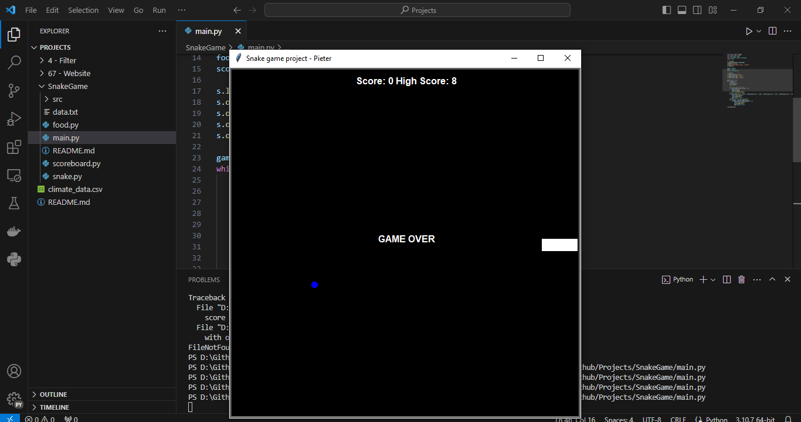
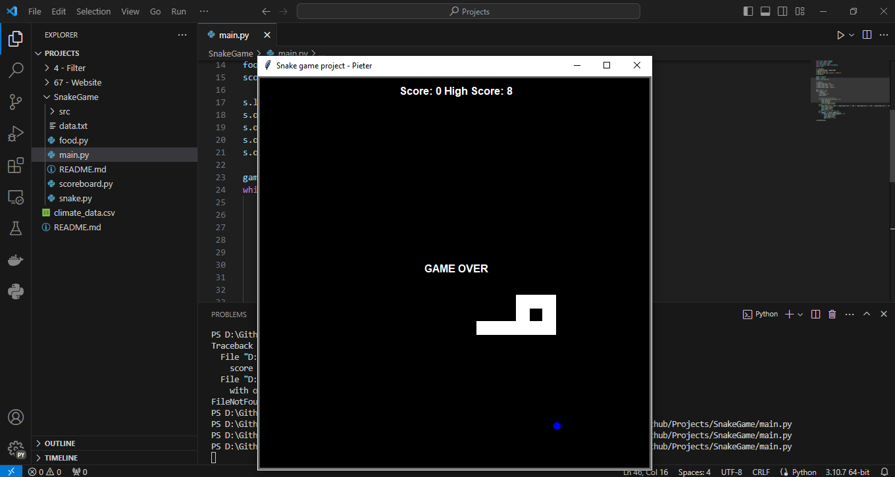
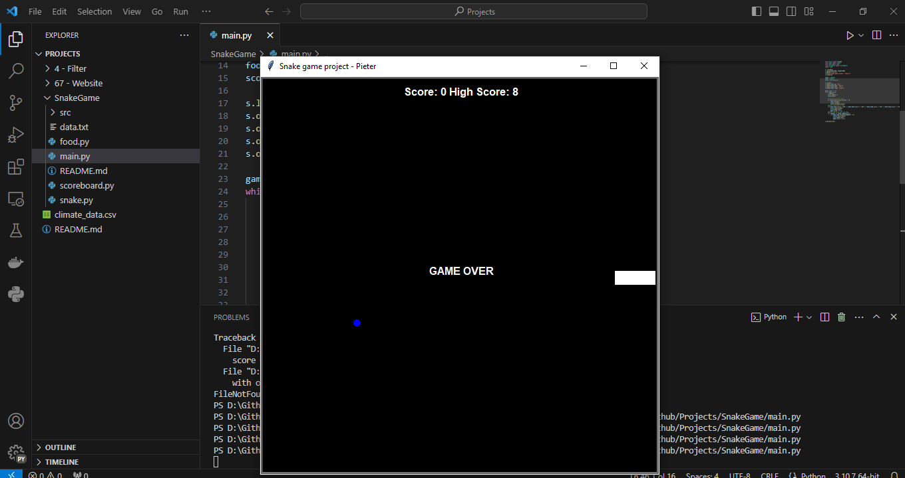
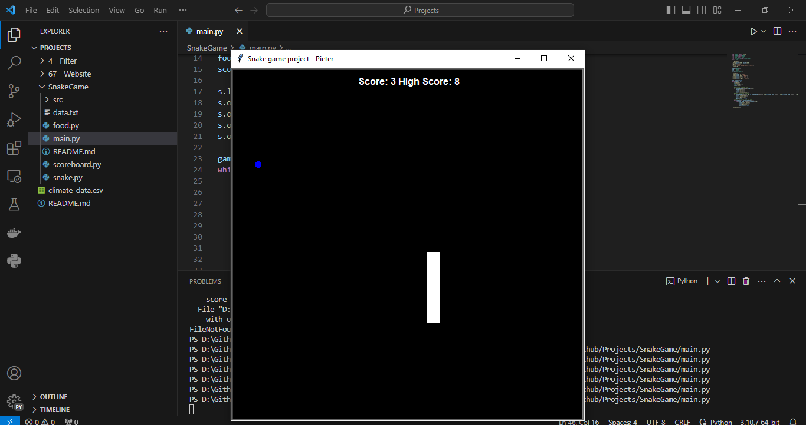

<!-- Improved compatibility of back to top link: See: https://github.com/othneildrew/Best-README-Template/pull/73 -->
<a id="readme-top"></a>
<!--
*** Thanks for checking out the Best-README-Template. If you have a suggestion
*** that would make this better, please fork the repo and create a pull request
*** or simply open an issue with the tag "enhancement".
*** Don't forget to give the project a star!
*** Thanks again! Now go create something AMAZING! :D
-->


<!-- PROJECT SHIELDS -->
<!--
*** I'm using markdown "reference style" links for readability.
*** Reference links are enclosed in brackets [ ] instead of parentheses ( ).
*** See the bottom of this document for the declaration of the reference variables
*** for contributors-url, forks-url, etc. This is an optional, concise syntax you may use.
*** https://www.markdownguide.org/basic-syntax/#reference-style-links
-->
[![Contributors][contributors-shield]][contributors-url]
[![Forks][forks-shield]][forks-url]
[![Stargazers][stars-shield]][stars-url]
[![Issues][issues-shield]][issues-url]
[![LinkedIn][linkedin-shield]][linkedin-url]

<!-- PROJECT LOGO -->
<br />
<div align="center">
  <a href="https://github.com/Pieter414/Projects/tree/main/SnakeGame">
    
  </a>

<h3 align="center">Snake Game</h3>

  <p align="center">
    <a href="https://github.com/Pieter414/Projects/tree/main/SnakeGame"><strong>Explore the docs »</strong></a>
    <br />
    <br />
    <a href="https://github.com/Pieter414/Projects/tree/main/SnakeGame">View Demo</a>
    ·
    <a href="https://github.com/Pieter414/Projects/issues/new?labels=bug&template=bug-report---.md">Report Bug</a>
    ·
    <a href="https://github.com/Pieter414/Projects/issues/new?labels=enhancement&template=feature-request---.md">Request Feature</a>
  </p>
</div>


<!-- TABLE OF CONTENTS -->
<details>
  <summary>Table of Contents</summary>
  <ol>
    <li>
      <a href="#about-the-project">About The Project</a>
      <ul>
        <li><a href="#built-with">Built With</a></li>
      </ul>
    </li>
    <li>
      <a href="#getting-started">Getting Started</a>
      <ul>
        <li><a href="#prerequisites">Prerequisites</a></li>
      </ul>
    </li>
    <li><a href="#usage">Usage</a></li>
    <li><a href="#contact">Contact</a></li>
    <li><a href="#acknowledgments">Acknowledgments</a></li>
  </ol>
</details>


<!-- ABOUT THE PROJECT -->
## About The Project

This project means to recreate the classic snake game. The player can control the "snake" that automates going around the screen and eating the blue dot as food to grow. There is also a score and high score counter going to track your score. The player can use the 'up' key, 'down' key, 'left' key, and 'right' key to move the head of the snake. If the snake hits his tail or hits a wall, the game is over and the program tracks this game score and the highest score.

<p align="right">(<a href="#readme-top">back to top</a>)</p>


### Built With

* [![Python][python.org]][Python-url]

<p align="right">(<a href="#readme-top">back to top</a>)</p>


<!-- GETTING STARTED -->
## Getting Started

### Prerequisites

1. Python and Turtle

### How to Run
run the main.py program
```
python .\SnakeGame\main.py
```

or in SnakeGame directory
```
python main.py
```

<p align="right">(<a href="#readme-top">back to top</a>)</p>


<!-- USAGE EXAMPLES -->
## Usage

1. The screen will appear, there black screen with one snake that moves toward the right, a blue dot to assemble food, and a scoreboard. 

2. Move the snake using the 'up' key, 'down' key, 'left' key, or 'right' key. 
3. If the snake hits the food, it going to add the snake length one block

4. If the snake hits tail, the game is over

5. If the snake hit the wall, the game is over

6. To play it again, run the main.py again

_For more examples, please refer to the [Documentation](https://github.com/Pieter414/Projects/tree/main/SnakeGames)_

See the [open issues](https://github.com/Pieter414/Projects/issues) for a full list of proposed features (and known issues).

<p align="right">(<a href="#readme-top">back to top</a>)</p>

<!-- LICENSE -->
## License

Distributed under the MIT License. See `LICENSE.txt` for more information.

<p align="right">(<a href="#readme-top">back to top</a>)</p>


<!-- CONTACT -->
## Contact

Pieter Christy Yan Yudhistira- [linkedin-url](https://www.linkedin.com/in/pieter-christy-yan-yudhistira/) - pieterchristyan7@gmail.com

Project Link: [https://github.com/Pieter414/Projects](https://github.com/Pieter414/Projects)

<p align="right">(<a href="#readme-top">back to top</a>)</p>


<!-- ACKNOWLEDGMENTS -->
## Acknowledgments

* [100 Days of Code: The Complete Python Pro Bootcamp](https://www.udemy.com/course/100-days-of-code/)

<p align="right">(<a href="#readme-top">back to top</a>)</p>


<!-- MARKDOWN LINKS & IMAGES -->
<!-- https://www.markdownguide.org/basic-syntax/#reference-style-links -->
[contributors-shield]: https://img.shields.io/github/contributors/pieter414/Projects.svg?style=for-the-badge
[contributors-url]:  https://github.com/Pieter414/Projects/graphs/contributors
[forks-shield]: https://img.shields.io/github/forks/pieter414/Projects.svg?style=for-the-badge
[forks-url]:  https://github.com/Pieter414/Projects/network/members
[stars-shield]: https://img.shields.io/github/stars/pieter414/Projects.svg?style=for-the-badge
[stars-url]:  https://github.com/Pieter414/Projects//stargazers
[issues-shield]: https://img.shields.io/github/issues/pieter414/Projects.svg?style=for-the-badge
[issues-url]:  https://github.com/Pieter414/Projects//issues
[linkedin-shield]: https://img.shields.io/badge/-LinkedIn-black.svg?style=for-the-badge&logo=linkedin&colorB=555
[linkedin-url]: https://www.linkedin.com/in/pieter-christy-yan-yudhistira/
[product-screenshot]: images/screenshot.png
[Bootstrap.com]: https://img.shields.io/badge/Bootstrap-563D7C?style=for-the-badge&logo=bootstrap&logoColor=white
[Bootstrap-url]: https://getbootstrap.com
[python.org]: https://img.shields.io/badge/python-3670A0?style=for-the-badge&logo=python&logoColor=ffdd54
[Python-url]: https://python.org
